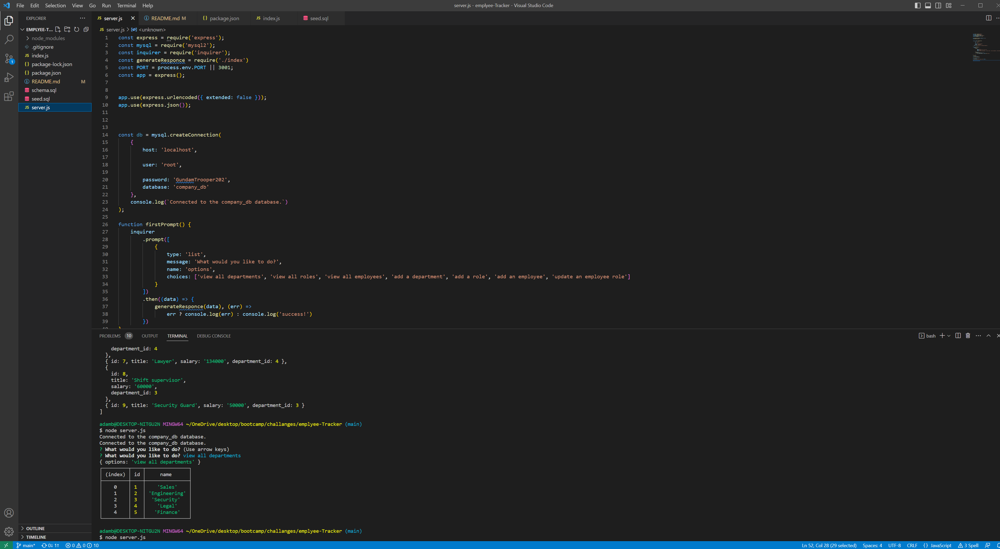

# emplyee-Tracker

## Description

- As an employ to a small start up company, the manager approached me to develop an employee to help him keep track of the company payroll.
- having no prior code to work off of i started by building the sql pages for my frame work and seed data for demonstration. I then went and created the necessary server, index and package pages.
- Some key take away lessons was the syntax to both call back relevant data and have it persist on the local server, the SQL syntax, and get the input data into the Data Bases in the correct format. 
- unfortunately this application still needs work do to it not being able to update and having to turn the server on and off again to select other options. I intend to revisit this application for full functionality in the future.

## Table of Contents (Optional)

- [Installation](#installation)
- [Usage](#usage)
- [Credits](#credits)
- [License](#license)

## Installation

- users will have have to run the 'npm i' command in their terminal to install the Express, mySQL, and Inquirer functionality
- [CrowTrooper202](https://github.com/CrowTrooper202/emplyee-Tracker)

## Usage

- 
- [Employee Tracker Application](https://drive.google.com/file/d/1WDOEhwmkYVyJg2urS8cSE7EkSWcQSbJP/view)

## Credits

-N/A

## License

-N/A